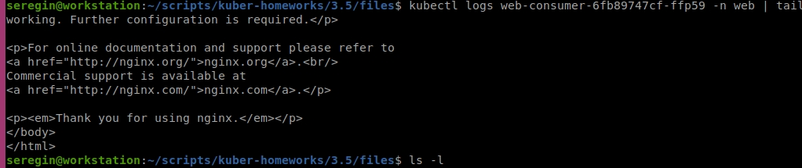

# Домашнее задание к занятию Troubleshooting

### Цель задания

Устранить неисправности при деплое приложения.

### Чеклист готовности к домашнему заданию

1. Кластер K8s.

### Задание. При деплое приложение web-consumer не может подключиться к auth-db. Необходимо это исправить

1. Установить приложение по команде:
```shell
kubectl apply -f https://raw.githubusercontent.com/netology-code/kuber-homeworks/main/3.5/files/task.yaml
```
> 2. Выявить проблему и описать.

Первая проблема возникает сразу при запуске:

```
Error from server (NotFound): error when creating "https://raw.githubusercontent.com/netology-code/kuber-homeworks/main/3.5/files/task.yaml": namespaces "web" not found
Error from server (NotFound): error when creating "https://raw.githubusercontent.com/netology-code/kuber-homeworks/main/3.5/files/task.yaml": namespaces "data" not found
Error from server (NotFound): error when creating "https://raw.githubusercontent.com/netology-code/kuber-homeworks/main/3.5/files/task.yaml": namespaces "data" not found
```

Создаем два неймспейса. Запускаем. Делаем `kubectl logs web-consumer-5f87765478-2nhwh -n web`:

```
curl: (6) Couldn't resolve host 'auth-db'
curl: (6) Couldn't resolve host 'auth-db'
curl: (6) Couldn't resolve host 'auth-db'
curl: (6) Couldn't resolve host 'auth-db'
curl: (6) Couldn't resolve host 'auth-db'
```

Понимаем, что один сервис не может увидеть второй, тк они находятся в разных неймспейсах. Мыслим варианты навскидку:
Очевидный выход - засунуть их в один неймспейс. Самый наименее трудозатратный. Однако может быть что у нас разграничение прав по неймспейсам, тем самым мы кому-то обрубим доступ. Копаем дальше.
Еще один очевидный, но совсем не надежный - залезть внутрь контейнера web и просто добавить в hosts.

В реальности все это происходит, потому что в куберовском DNS имя сервиса состоит из `под.сервис.неймспейс.svc.cluster.local` https://labex.io/questions/how-to-access-a-kubernetes-service-across-namespaces-9199, то есть фактически обратиться нам надо к `auth-db.data.svc.cluster.local`, в то время акк находясь в другом неймспейсе мы обращаемся на `auth-db.web.svc.cluster.local`, а такого хоста разумеется нет.


> 3. Исправить проблему, описать, что сделано.

Правим 20 строку файла деплоя и меняем имя хоста на FQDN указанный выше

```
        - while true; do curl auth-db.data.svc.cluster.local; sleep 5; done
```

> 4. Продемонстрировать, что проблема решена.

Проверяем - все работает.




### Правила приёма работы

1. Домашняя работа оформляется в своём Git-репозитории в файле README.md. Выполненное домашнее задание пришлите ссылкой на .md-файл в вашем репозитории.
2. Файл README.md должен содержать скриншоты вывода необходимых команд, а также скриншоты результатов.
3. Репозиторий должен содержать тексты манифестов или ссылки на них в файле README.md.
